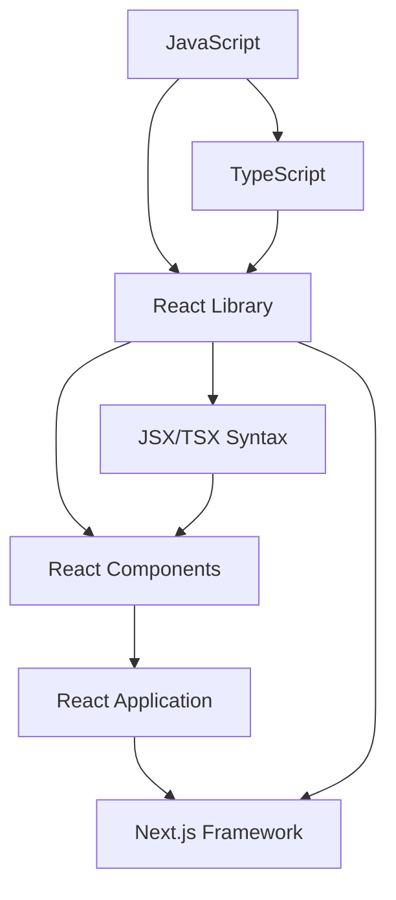

# フロントエンド開発メモ

## 概念

- Next.js
  - React
  - JSX,TSX



## 技術 topics

### Web サイトの構成

1. ボタンのような UI のパーツ
2. それらを配置するレイアウトや余白

### default export と named export

コンポーネント等を他のファイルで import して利用するためには、export をしておく必要がある。

1 つのファイルで 2 つ以上のコンポーネントや値などを export するには、`named export` をする必要があります。

```typescript
export function ButtonLink() {}
```

コンポーネントなどを 1 つのファイルで 1 つの場合は、`default export`

### props と children

コンポーネントに値を渡すために`props`を利用

`props`は定義した様々な値をコンポーネントに渡すことができる要素

### ルーティング(App Router)

app/ディレクトリでのルーティングを行う仕組みのことを**App Router**と呼ぶ

Next.js の App Router は 2 種類のコンポーネントに分けられる

1. サーバーコンポーネント

'use client'をつけないと app 配下すべてのコンポーネントがデフォルトでコンポーネントになる。

2. クライアントコンポーネント

use client を付与したコンポーネントをクライアントコンポーネントと呼ぶ
クライアントすなわちユーザーが操作しているブラウザ上で実行される

#### URL の仕組み

https://example.com/about

https⇒ プロトコル
example.com⇒ ドメイン
about⇒ パス

#### Next.js の仕組み

通常、<a>タグでリンク遷移を実装するが、Next.js では `next/link` という機能を利用する。

### JSX での三項演算子

JSX では三項演算子が使われやすい（機能は if 文と同じ）

### レイアウト整備

`layout.tsx`でレイアウトを定義

### Hero コンポーネント

Hero コンポーネントを作成すると、サイト全体の統一感を出すことができる。

## コンポーネント

> [!IMPORTANT]
> コンポーネントに分けることで複雑な処理を整理できる。
> 1 つの page.tsx ファイルやコンポーネントに多くの処理を含めてしまうとバグの原因やコードの可読性が低下する。

## useState で Web サイトに動きをつける

`classnames`をインストール

```bash
npm install classnames
```

## バックエンド

### API

API とは異なるソフトウェアやアプリケーションとの間で通信を行う際に、データのやり取りをするための規格を表すもの

### エンドポイント

ある特定の機能を実行したり、特定のデータを取得したりするために、プログラムが通信を行う URL のこと

### API の型

- リスト形式
  複数コンテンツを取り扱える
- オブジェクト形式
  単一コンテンツを取り扱える

### API スキーマを定義する

実際にどのようなデータが返却されるか定義する

### 参考情報

- [Next.js 公式サイト](https://nextjs.org/docs)
- [TypeScript 公式サイト](https://www.typescriptlang.org/)
- [sample code ヘッドレス CMS](https://github.com/nextjs-microcms-book)
- [TypeScript チュートリアル](https://www.typescriptlang.org/docs/handbook/typescript-from-scratch.html)
- [Fragment 要素](https://ja.react.dev/reference/react/Fragment)
- [パフォーマンス改善](https://nextjs.org/docs/app/building-your-application/routing/linking-and-navigationg#2-prefetching)
- [Next.js ファイル名規則](https://nextjs.org/docs/app/api-reference/file-conversions/not-found)
- [JSX での三項演算子](https://developer.mozilla.org/ja/docs/Web/JavaScript/Reference/Operators/Conditional_operator)
- [Nesting-layouts]()
- [Typescript ジェネリクス](https://www.typescriptlang.org/docs/handbook/2/generics.html)
- [非同期処理](https://developer.mozilla.org/ja/docs/Web/JavaScript/Reference/Global_Objects/Promise)

## Kuroco チュートリアル

- [sample code](https://github.com/diverta/front_nuxt_auth)
- [quick guide](https://kuroco.app/ja/quick-guide/)

##

> [!NOTE]
> Useful information that users should know, even when skimming content.

> [!TIP]
> Helpful advice for doing things better or more easily.

> [!WARNING]
> Urgent info that needs immediate user attention to avoid problems.

> [!CAUTION]
> Advises about risks or negative outcomes of certain actions.
